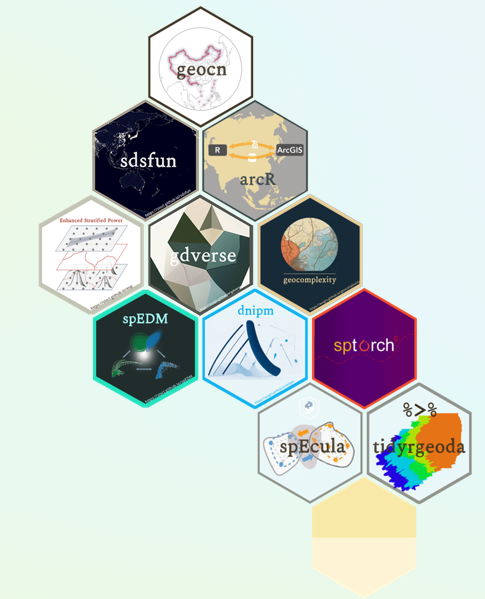
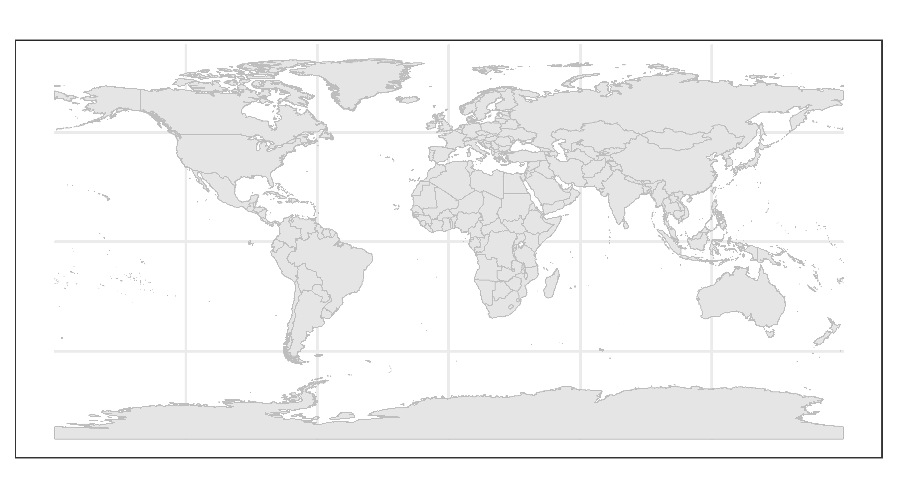
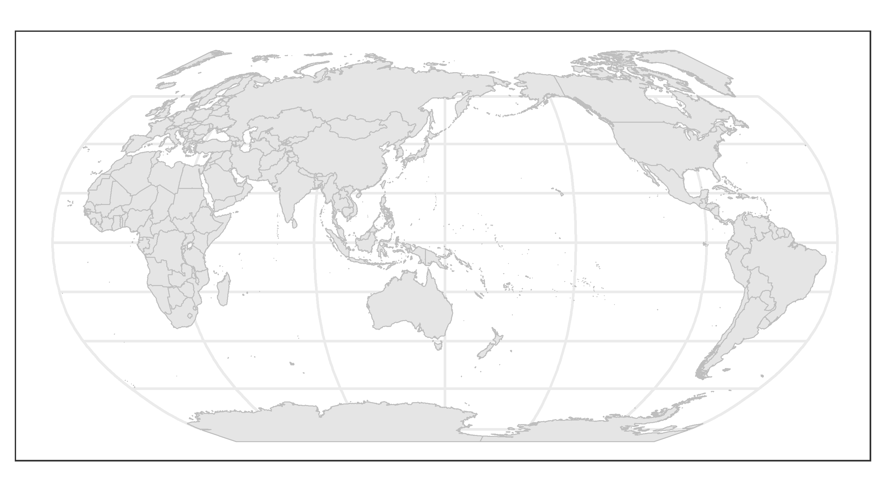
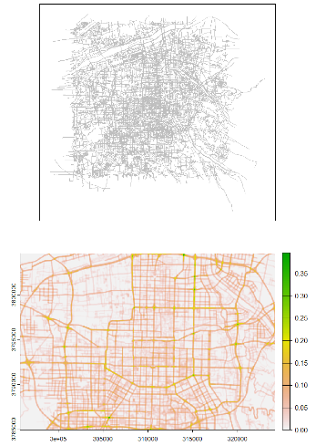
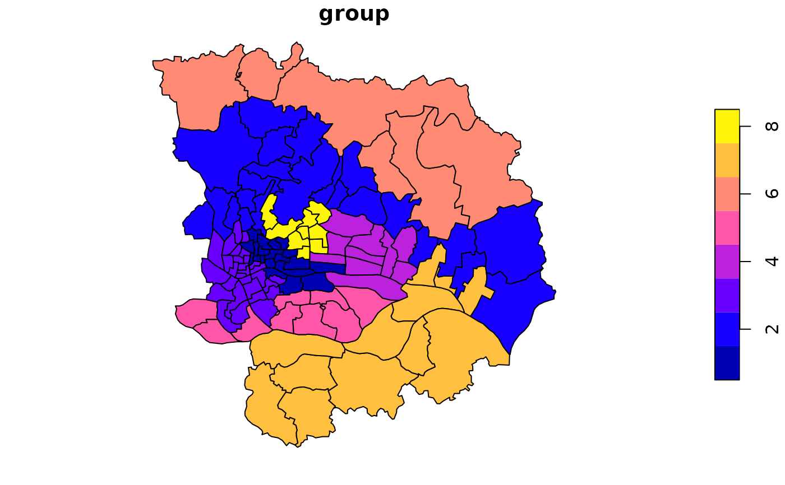
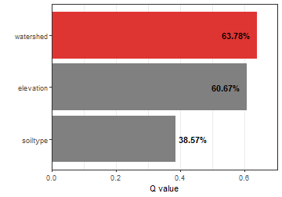
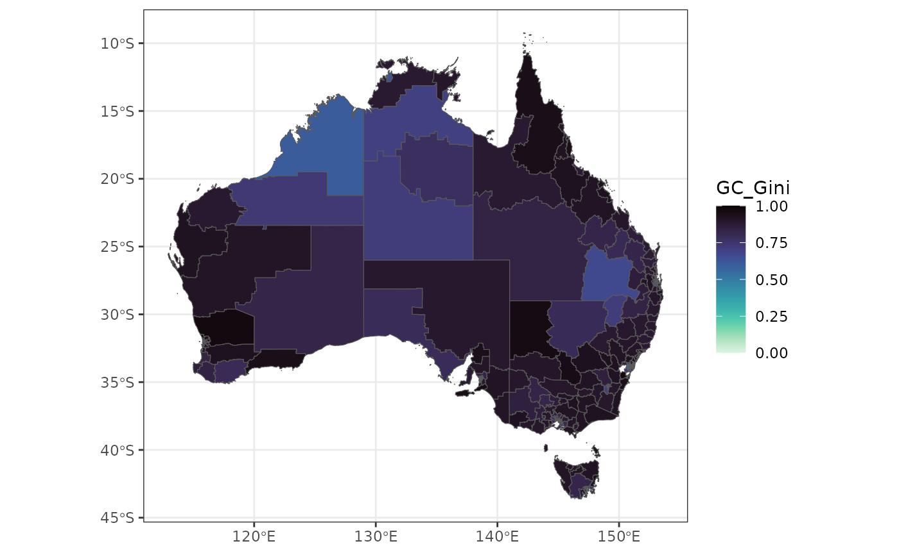

class: title-slide

```{r setup, include = FALSE}
knitr::opts_chunk$set(echo = TRUE,
                      dpi = 600,
                      warning = FALSE,
                      message = FALSE,
                      out.width = "100%",
                      out.height = "400px",
                      fig.align = 'center',
                      comment = "##",
                      fig.path = "assets/figures/",
                      htmltools.dir.version = FALSE)
```

```{css,echo=FALSE}
@import url(https://fonts.googleapis.com/css?family=Inconsolata);
@import url('https://fonts.googleapis.com/css?family=Roboto+Condensed:300,300i,600');
@import url('https://fonts.googleapis.com/css?family=Roboto:600');

body {
  font-family: 'Roboto Condensed', 'Avenir Next', 'Helvetica Neue', 'Helvetica', sans-serif;
  font-weight: 300;
}
h1, h2, h3 {
  font-family: 'Roboto', 'Avenir Next', 'Helvetica Neue', 'Helvetica', sans-serif;
  font-weight: 600;
}
.remark-code, .remark-inline-code { 
font-family: 'Inconsolata', 'Consolas', Monaco, monospace; 
}

.title-slide {
  background-image: url("https://spatlyu.github.io/materials/figures/ausgis_ppt_title_bg1.png");
  background-position: center;
  background-size: contain;
}

.pre {
      background-color: #ddd;
      border: 5px solid #ddd;
      padding: 10px;
      font-size: 14px;
      overflow: auto;
      border-radius: 4px;
    }
    
.center-img {
    text-align: center;
  }
```

---
class: inverse, middle, center
background-image: url("https://spatlyu.github.io/materials/figures/ausgis_ppt_title_bg3.png")
background-position: center
background-size: contain

# R Learning materials

---
background-image: url("https://spatlyu.github.io/materials/figures/ausgis_ppt_title_bg4.png")
background-position: center
background-size: contain

--

.pull-left[

#### [<span style="color: #5b7b75;display: block;margin-top: 120px;"> Geocomputation with R </span>](https://r.geocompx.org/)

#### [<span style="color: #5b7b75;"> Spatial Data Science With Applications in R </span>](https://r-spatial.org/book/)

#### [<span style="color: #5b7b75;"> Spatial data with terra </span>](https://rspatial.org/spatial/index.html)

#### [<span style="color: #5b7b75;"> Introduction to BaseR </span>](https://rspatial.org/intr/)

#### [<span style="color: #5b7b75;"> Advanced R </span>](https://adv-r.hadley.nz/)

#### [<span style="color: #5b7b75;"> R for Data Science (2e) & tidyverse </span>](https://r4ds.hadley.nz/)

#### [<span style="color: #5b7b75;"> Unofficial Rcpp Api Documentation </span>](https://thecoatlessprofessor.com/programming/cpp/unofficial-rcpp-api-documentation/)

]

--

.pull-right[
## <span style="display: block;margin-top: 150px;">For the full version of resource recommendations, please refer to [my blog](https://spatlyu.github.io/posts/r-books/).</span>
]

---
class: inverse, middle, center
background-image: url("https://spatlyu.github.io/materials/figures/ausgis_ppt_title_bg3.png")
background-position: center
background-size: contain

# R packages developed by Wenbo Lv and his partners

---
background-image: url("https://spatlyu.github.io/materials/figures/ausgis_ppt_title_bg4.png")
background-position: center
background-size: contain

--

.pull-left[

## <span style="color: #4472c4;margin-top: 60px;">Content</span>

#### Geospatial Data 

- [geocn](https://stscl.github.io/geocn/)

#### Geospatial Processing

- [qgisprocess](https://r-spatial.github.io/qgisprocess/)

- [sdsfun](https://stscl.github.io/sdsfun/)

#### Geospatial Methods

- [gdverse](https://ausgis.github.io/gdverse/)

- [geocomplexity](https://ausgis.github.io/geocomplexity/)

*And ...* 🤔

]

--

.pull-right[



]

---
class: inverse, middle, center
background-image: url("https://spatlyu.github.io/materials/figures/ausgis_ppt_title_bg3.png")
background-position: center
background-size: contain

# Tutorials for My Open Source Geospatial Packages

---
background-image: url("./assets/pkgs.jpg")
background-position: center
background-size: contain

--

.pull-left[

## <span style="color: #4472c4;display: block;margin-top: 70px;"> [geocn](https://stscl.github.io/geocn/)</span>

#### Loads Spatial Data Sets of China

```r
library(sf)
library(geocn)
library(ggplot2)

albers = load_cn_alberproj()
province = load_cn_province()
province_albers = st_transform(province,albers)
ggplot(data = province_albers) +
  geom_sf(fill = 'grey90', color = 'grey') +
  theme_bw()
```

]

--

.pull-right[
<div class="center-img">

</div>
]

---
background-image: url("./assets/pkgs.jpg")
background-position: center
background-size: contain

--

.pull-left[
<div style="margin-top: 70px;">

<pre><code>
library(sf)
library(geocn)
library(ggplot2)

world1 = load_world_country(center = "west")
ggplot(data = world1) +
  geom_sf(fill = 'grey90', color = 'grey') +
  theme_bw()
</code></pre>


</div>
]

--

.pull-right[

<div style="margin-top: 70px;">

<pre><code>
library(sf)
library(geocn)
library(ggplot2)

world2 = load_world_country(center = "east")
ggplot(data = world2) +
  geom_sf(fill = 'grey90', color = 'grey') +
  theme_bw()
</code></pre>


</div>
]

---
background-image: url("./assets/pkgs.jpg")
background-position: center
background-size: contain

--

.pull-left[

## <span style="color: #4472c4;display: block;margin-top: 70px;"> [qgisprocess](https://r-spatial.github.io/qgisprocess/)</span>

#### Use QGIS Processing Algorithms in R

```r
library(qgisprocess)
# Load data
road = read_sf('./data/osm.gdb/',layer='road') |> 
  st_transform(32649)
# Weighting according to road type
road |> 
  dplyr::mutate(weight = dplyr::case_match(highway,
                              c('motorway','primary') ~ 5,
                         c('motorway_link','primary_link','trunk','secondary') ~ 4,
                              c('trunk_link','secondary_link','tertiary') ~ 3,
                              c('tertiary_link','residential') ~ 2,
                              .default = 1)) -> road
qgis_run_algorithm(
  algorithm = "native:linedensity",INPUT = road,
  WEIGHT = "weight",RADIUS = 90,PIXEL_SIZE = 30) |> 
  qgis_as_terra()-> RD
```

]

--

.pull-right[
<div class="center-img">

</div>
]

---
background-image: url("./assets/pkgs.jpg")
background-position: center
background-size: contain

--

.pull-left[

## <span style="color: #4472c4;display: block;margin-top: 70px;"> [sdsfun](https://stscl.github.io/sdsfun/)</span>

#### Spatial Data Science Complementary Features

```r
library(sf)
gzma = read_sf(system.file('extdata/gzma.gpkg',package = 'sdsfun'))
gzma_c = sdsfun::spdep_skater(gzma,8)
gzma$group = gzma_c
plot(gzma["group"])
```

]

--

.pull-right[
<div class="center-img">

</div>
]

---
background-image: url("./assets/pkgs.jpg")
background-position: center
background-size: contain

--

.pull-left[
```{r}
library(sf)
library(sdsfun)
pts = read_sf(system.file('extdata/pts.gpkg',package = 'sdsfun'))

wt1 = spdep_distance_swm(pts, style = 'B')
wt2 = spdep_distance_swm(pts, kernel = 'gaussian')
wt3 = spdep_distance_swm(pts, k = 3, kernel = 'gaussian')
wt4 = spdep_distance_swm(pts, k = 3, kernel = 'gaussian', bandwidth = 10000)
wt4[1:5,1:5]
```

<!-- <div style="margin-top: 70px;"> -->
<!-- <pre><code> -->
<!-- library(sf) -->
<!-- library(sdsfun) -->
<!-- pts = read_sf(system.file('extdata/pts.gpkg',package = 'sdsfun')) -->

<!-- wt1 = spdep_distance_swm(pts, style = 'B') -->
<!-- wt2 = spdep_distance_swm(pts, kernel = 'gaussian') -->
<!-- wt3 = spdep_distance_swm(pts, k = 3, kernel = 'gaussian') -->
<!-- wt4 = spdep_distance_swm(pts, k = 3, kernel = 'gaussian', bandwidth = 10000) -->
<!-- </code></pre> -->
<!-- </div> -->
]

--

.pull-right[

```{r}
library(sf)
library(sdsfun)
pts = read_sf(system.file('extdata/pts.gpkg',package = 'sdsfun'))

wt1 = spdep_contiguity_swm(pts, k = 6, style = 'B')
wt2 = spdep_contiguity_swm(pts, queen = TRUE, style = 'B')
wt3 = spdep_contiguity_swm(pts, queen = FALSE, order = 2, style = 'B')
wt3[1:5,1:5]
```


<!-- <div style="margin-top: 70px;"> -->

<!-- <pre><code> -->
<!-- library(sf) -->
<!-- library(sdsfun) -->
<!-- pts = read_sf(system.file('extdata/pts.gpkg',package = 'sdsfun')) -->

<!-- wt1 = spdep_contiguity_swm(pts, k = 6, style = 'B') -->
<!-- wt2 = spdep_contiguity_swm(pts, queen = TRUE, style = 'B') -->
<!-- wt3 = spdep_contiguity_swm(pts, queen = FALSE, order = 2, style = 'B') -->
<!-- </code></pre> -->

]

---
background-image: url("./assets/pkgs.jpg")
background-position: center
background-size: contain

--

.pull-left[

## <span style="color: ##5b7b75;display: block;margin-top: 60px;"> [gdverse](https://ausgis.github.io/gdverse/)</span>

#### Geographical Detector Models

```{r}
library(gdverse)
fd = gd(incidence ~ watershed + elevation + soiltype,
        data = NTDs,type = 'factor')
fd
```

]

--

.pull-right[

<div class="center-img">

</div>

]

---
background-image: url("./assets/pkgs.jpg")
background-position: center
background-size: contain

--

.pull-left[

## <span style="color: ##91a5addisplay: block;margin-top: 80px;"> [geocomplexity](https://ausgis.github.io/geocomplexity/)</span>

#### Geocomplexity Mitigates Spatial Bias

```r
library(geocomplexity)
econineq = sf::read_sf(system.file('extdata/econineq.gpkg',package = 'geocomplexity'))
gc = geocd_vector(econineq)

library(ggplot2)
library(viridis)
ggplot(gc) +
   geom_sf(aes(fill = GC_Gini)) +
   scale_fill_viridis(option = "mako", direction = -1) +
   theme_bw()
```

]

--

.pull-right[
<div class="center-img">

</div>
]

---
class: center, middle
background-image: url("https://spatlyu.github.io/materials/figures/ausgis_ppt_title_bg3.png")
background-position: center
background-size: contain

# Thanks

### Wenbo Lv

### lyu.geosocial@gmail.com