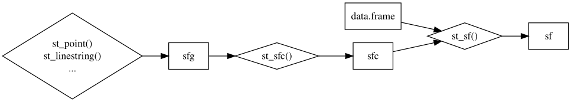
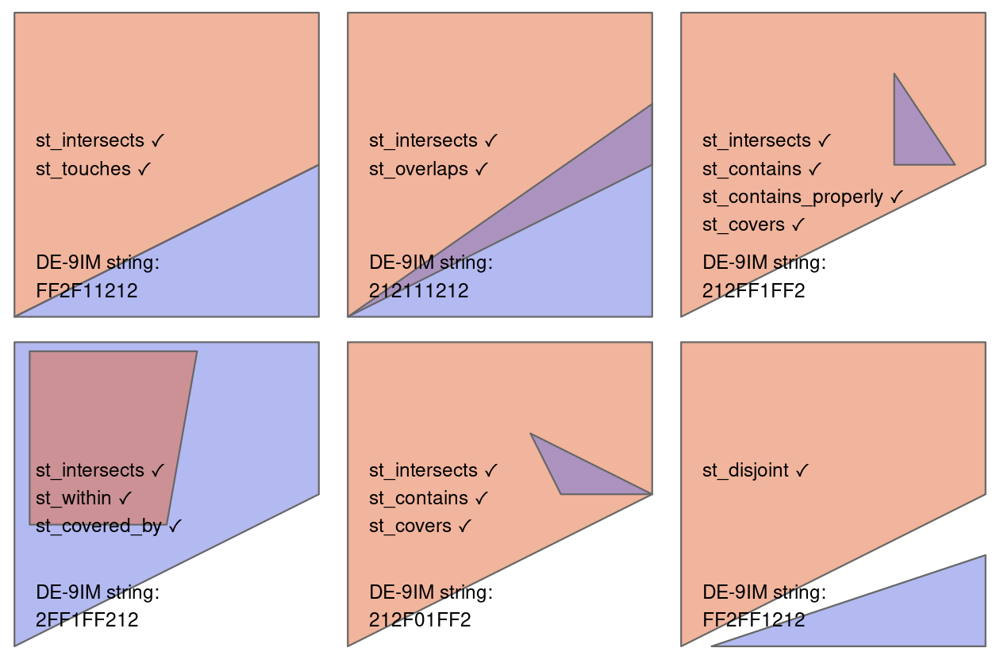

```{r setup, include = FALSE}
knitr::opts_chunk$set(echo = TRUE,
                      dpi = 300,
                      warning = FALSE,
                      message = FALSE,
                      out.width = "100%",
                      out.height = "300px",
                      fig.align = 'center',
                      comment = "##")
```

## 1. `sf`中的空间对象

### 1.1 `sf`与`simple features`

#### 1.1.1 `sf`包简介

`sf`包集成了`GDAL`、`PROJ`、`GEOS`、`S2`的功能，提供了一个`R`语言的接口，它支持简单要素类`simple features`，并提供了丰富的函数进行数据转换、分析和可视化。与`R`语言中其他空间分析包(如`terra`、`stars`、`qgisprocess`)兼容性良好，并支持很多`tidyverse`中的数据操作函数。同时`sf`包也具备高效的性能和强大的空间分析功能，如缓冲区分析、叠加分析、创建渔网等。`sf`类似于`Python`中的`geopandas`但比`geopandas`的API设计要更简洁和规范(`sf`参考了很多`PostGIS`的设计),同时`sf`默认地理坐标系使用谷歌开发的`S2`空间索引算法运算，相较于`GEOS`在`planr`下的地理坐标系运算有较大的进步。`sf`包主要由`Edzer Pebesma`教授维护和开发(edzer教授同时也是`sp`、`gstat`、`stars`、`s2`、`units`等包的作者)，关于`sf`包的bug反馈请前往[sf的github repo](https://github.com/r-spatial/sf)


#### 1.1.2 `simple features` 简单要素类

`simple features`是一个由[`OGC`](https://www.ogc.org/)开发和推广的地理空间矢量数据标准，它是一个层次化的数据模型。在该数据标准支持的最高达18种几何类型中，只有7种被大多数地理空间数据广泛使用(如下图所示)，而`sf`包完全支持这7种常用的几何类型,我们在后面将详细介绍这7种常用的几何类型。


### 1.2 常用的7种几何类型

  `sf`中常用的7种几何类型分别是`point` 与 `multipoint`、`linestring` 与 `multilinestring`、`polygon` 与 `multipolygon`以及`geometry collection`，我们需要输入`R`中的数据对象从而使用`sf`提供的函数从头创建几何类型，具体来说 我们使用`st_`前缀加上对应的小写几何类型组成的函数结合R中的数据对象从头创建`sf`中的几何类型(如使用`st_point`和数字向量创建点，`st_linestring`和矩阵创建线段)。 `R`中的数据对象和使用`sf`包可以创建的几何类型的对应关系如下:

- vector: 对应一个单独的点`point`
- matrix: 对应多点对象`multipoint`、单独的线段`linestring`
- list: 矩阵对象的集合;对应`multilinestring`、`polygon`、`multipolygon`、
`geometry collections`

```{r}
library(sf)

# XY point
st_point(c(5, 2))
# XYZ point
st_point(c(5, 2, 3))              
# XYM point
st_point(c(5, 2, 1), dim = "XYM") 
# XYZM point
st_point(c(5, 2, 3, 1)) 
# MULTIPOINT
multipoint_matrix = matrix(c(5, 2, 1, 3, 3, 4, 3, 2),
                           ncol = 2,byrow = T)
st_multipoint(multipoint_matrix)
plot(st_multipoint(multipoint_matrix),axes = T, col = 'red')
# LINESTRING
linestring_matrix = matrix(c(1, 5, 4, 4, 4, 1, 2, 2, 3, 2),
                           ncol = 2,byrow = T)
st_linestring(linestring_matrix)
plot(st_linestring(linestring_matrix),axes = T, col = 'red')
# POLYGON 需要注意从头创建面时起点和终点点坐标要重合以保证面闭合
polygon_list = list(matrix(c(1, 5, 2, 2, 4, 1, 4, 4, 1, 5),
                           ncol = 2,byrow = T))
st_polygon(polygon_list)
plot(st_polygon(polygon_list),axes = T,col = 'grey', border = 'red')
# POLYGON with a hole 内部有空洞的面
polygon_border = matrix(c(1, 5, 2, 2, 4, 1, 4, 4, 1, 5),
                        ncol = 2,byrow = T)
polygon_hole = matrix(c(2, 4, 3, 4, 3, 3, 2, 3, 2, 4),
                      ncol = 2,byrow = T)
polygon_with_hole_list = list(polygon_border, polygon_hole)
st_polygon(polygon_with_hole_list)
plot(st_combine(st_sfc(st_polygon(list(polygon_border)),
                       st_polygon(list(polygon_hole)))),
                axes = T, col = "transparent", border = "red")
# MULTILINESTRING
multilinestring_list = list(matrix(c(1, 5, 4, 4, 4, 1, 2, 2, 3, 2),
                                   ncol = 2,byrow = T), 
                            matrix(c(1, 2, 2, 4),
                                   ncol = 2,byrow = T))
st_multilinestring(multilinestring_list)
plot(st_multilinestring(multilinestring_list), col = "red", axes = T)
# MULTIPOLYGON
multipolygon_list = list(list(matrix(c(1, 5, 2, 2, 4, 1, 4, 4, 1, 5),
                                     ncol = 2,byrow = T)),
                         list(matrix(c(0, 2, 1, 2, 1, 3, 0, 3, 0, 2),
                                     ncol = 2,byrow = T)))
st_multipolygon(multipolygon_list)
plot(st_multipolygon(multipolygon_list),axes = T, border = "red", col = "grey")
# GEOMETRYCOLLECTION
geometrycollection_list = list(st_multipoint(multipoint_matrix),
                               st_linestring(linestring_matrix))
st_geometrycollection(geometrycollection_list)
plot(st_geometrycollection(geometrycollection_list),axes = T, col = 'grey')
```

这里我们从头创建的几何类型都是`sfg`类，我们知道实际上空间矢量数据包括属性字段和几何要素，那么在sf包中空间矢量数据是如何组织的呢，请继续往下看：

### 1.3 `sf`中的空间数据组织

简单要素类由两部分组成: 几何对象和非空间的属性字段，下图展示了一个sf对象是如何被创建的。



在`sf`包中，创建`sf`类的几何对象来自`sfc`类，属性字段来自`data.frame`或`tibble`.`sfg`(simple feature geometries)即为我们在1.2部分提到的7种几何类型,然而一个sfg对象只包括一个简单要素类几何对象.实际上，一个空间矢量数据可能具备很多几何对象(比如西安市有11个区县级行政区划面).一个`sfc`对象就是一个或多个`sfg`对象的集合,`sfc`对象还能够包含关于所使用的坐标系统(坐标系统这里不再赘述,请参考[这篇知乎文章](https://zhuanlan.zhihu.com/p/62864791))的信息.要将两个sfg对象合成一个具有sfc对象,我们可以使用`st_sfc()`函数.

```{r}
point1 = st_point(c(5, 2))
point2 = st_point(c(1, 3))
points_sfc = st_sfc(point1, point2)
points_sfc
```

我们可以通过`st_geometry_type()`查看`sfc`对象的几何类型

```{r}
st_geometry_type(points_sfc)
```

不同类型的`sfg`对象也可以合并为一个`sfc`对象.

```{r}
st_sfc(st_polygon(polygon_with_hole_list),
       st_multilinestring(multilinestring_list))
```

你可能已经注意到输出信息中`CRS`显示为`NA`,前面部分也提到sfc对象还可以存储坐标系统信息。默认值是 NA (Not Vacable) ，可以用`st_crs()`查看sfc对象的坐标系统:

```{r}
st_crs(points_sfc)
```

我们可以在创建sfc对象时通过指定`crs`参数以定义坐标系统:

```{r}
points_sfc = st_sfc(point1, point2, crs = "EPSG:4326")
points_sfc
```

也可以在创建完sfc对象之后使用`st_set_crs()`为其设置坐标系统:

```{r}
points_sfc = st_sfc(point1, point2)
points_sfc = st_set_crs(points_sfc,"EPSG:4326")
points_sfc
```

`sfc`对象是`sf`对象中的几何列.`sf`对象额外包括了一些属性信息，下面以一个简单的`sf`对象创建为例演示:

```{r}
xian_point = st_point(c(108.56, 34.15)) 
xian_geom = st_sfc(xian_point, crs = "EPSG:4326")
xian_attrib = tibble::tibble(                   
  name = "Xi'an",
  temperature = units::set_units(1,'°C'),
  date = as.Date("2024-02-05")
)
xian_sf = st_sf(xian_attrib, geometry = xian_geom) 
xian_sf 
```

### 1.4 `sf`包空间数据的读入和写出

常用的矢量数据格式有`shapefile`、`geojson`、`geopackage`、`geodatabase`等，根据矢量数据的存储格式,使用`sf`读取数据略有不同:针对`shapefile`格式的数据,读取时提供`.shp`后缀的路径即可;针对`geojson`格式的数据,读取时提供`.geojson`后缀的路径即可;而`geopackage`、`geodatabase`是空间数据库，不仅需要提供`.gdb`和`.gpkg`格式的后缀，还需提供`layer`参数以指定加载的图层，如果是单一图层的空间数据库则无需指定`layer`参数.`sf`提供`st_read()`和`read_sf()`两个函数以读取矢量数据，两者区别在于后者读取数据时属性列用`tibble`存储,和`tidyverse`更搭。下面以`sf`包自带的数据为例演示数据的读入:

```{r}
system.file("gpkg/nc.gpkg", package="sf")

system.file("gpkg/nc.gpkg", package="sf") |> 
  read_sf() -> nc
nc

system.file("gpkg/nc.gpkg", package="sf") |> 
  st_read() -> nc
nc
```

写出矢量格式的数据使用`st_write()`或`write_sf()`即可,首先给出要写入的`sf`/`sfc`/`sfg`对象，接着提供文件路径，如果是`geopackage`和`geodatabase`格式的文件还需指定`layer`参数，重复导出至相同的数据文件请指定`overwrite`参数为`TRUE`.(PS:属性列中带中文的导出为`shp`由于`GDAL`引擎编码的问题可能会乱码，请参考[这篇博客](https://zhuanlan.zhihu.com/p/666619737)解决)

```r
write_sf(nc,'nc.gpkg',layer = 'nc',overwrite = TRUE)
```

### 1.5 关于`sf`中`s2`引擎的说明

`sf`包加载时显示的信息会提示你相应的GDAL、PROJ、GEOS版本，你可能也注意到了特殊的提示:`sf_use_s2() is TRUE`。此时`sf`默认打开`s2`运算引擎，当数据对象是地理坐标系时，sf将使用s2作为后端计算引擎而不是geos,如果你想使用geos进行地理坐标系下的数据运算，请使用这行命令关闭s2引擎:`sf_use_s2(FALSE)`;关于数据是否是地理坐标系请使用`st_is_longlat()`查看；无论s2引擎是否关闭，投影坐标系下的运算都是geos引擎~

### 1.6 常用`sf`构造数据的一些小tips

#### WGS84经纬度坐标点转矢量点对象:

```{r}
tibble::tibble(
  name = c('沈阳','长春','哈尔滨','北京','天津','呼和浩特','银川','太原','石家庄','济南','郑州','西安','武汉','南京','合肥','上海','长沙','南昌','杭州','福州','广州','台北','海口','南宁','重庆','昆明','贵阳','成都','兰州','西宁','拉萨','乌鲁木齐','香港','澳门'),
  lat = c(41.796768,43.886841,45.756966,39.904987,39.125595,40.84149,38.48644,37.857014,38.045475,36.675808,34.757977,34.263161,30.584354,32.041546,31.861191,31.231707,28.19409,28.676493,30.287458,26.075302,23.125177,25.030724,20.04422,22.82402,29.533155,25.040609,26.578342,30.659462,36.06138,36.61729,29.64415,43.82663,22.27534,22.19875),
  long = c(123.429092,125.324501,126.642464,116.405289,117.190186,111.75199,106.23248,112.549248,114.502464,117.000923,113.665413,108.948021,114.298569,118.76741,117.283043,121.472641,112.982277,115.892151,120.15358,119.306236,113.28064,121.520076,110.19989,108.320007,106.504959,102.71225,106.713478,104.065735,103.83417,101.77782,91.1145,87.61688,114.16546,113.54913)
) |> 
  st_as_sf(coords = c('long','lat'),
           crs = "EPSG:4326") -> provincep
provincep
plot(provincep)
```


## 2. `sf`中的空间运算

### 2.1 `predicates` 谓词运算
#### 2.1.1 `unary predicates` 一元谓词运算

**一元谓词运算描述了空间几何对象的某种性质**

`st_is_simple` 判断矢量对象是否自相交self-intersecting;自相交为`FALSE`否则为`TRUE`

```{r}
library(sf)
library(tidyverse)

ls = st_linestring(rbind(c(0,0), c(1,1), c(1,0), c(0,1)))
plot(ls)
tibble(
  long = c(110,120),
  lat = c(10,20)
) |> 
  st_as_sf(coords = c('long','lat'),
           crs = 4326) |> 
  st_bbox() |> 
  st_as_sfc() -> p
plot(p)
st_is_simple(ls)
st_is_simple(p)
```

`st_is_valid` 判断矢量几何对象拓扑是否正确
*错误的可以使用`st_make_valid`修复*
`st_is_empty` 判断矢量几何对象是否为空
`st_is_longlat` 判断矢量几何对象是否为地理坐标系

#### 2.1.2 `binary predicates` 二元谓词运算

*二元谓词运算涉及到两个空间对象间的拓扑关系,我们在这里不深入讲解，有兴趣的可以搜索
`DE-9IM`进行了解*

二元谓词运算具体如下所示:

|predicate                     |meaning                                                          |inverse of      |
|------------------------------|-----------------------------------------------------------------|----------------|
|`contains`                    |None of the points of A are outside B| `within`|
|`contains_properly`           |A contains B and B has no points in common with the boundary of A| |
|`covers`                      |No points of B lie in the exterior of A| `covered_by`|
|`covered_by`                  |Inverse of `covers`| |
|`crosses`                     |A and B have some but not all interior points in common| |
|`disjoint`                    |A and B have no points in common| `intersects`|
|`equals`                      |A and B are topologically equal: node order or number of nodes may differ; identical to A contains B and A within B|
|`equals_exact`                |A and B are geometrically equal, and have identical node order| |
|`intersects`                  |A and B are not disjoint| `disjoint`|
|`is_within_distance`          |A is closer to B than a given distance|
|`within`                      |None of the points of B are outside A| `contains`|
|`touches`                     |A and B have at least one boundary point in common, but no interior points|  |
|`overlaps`                    |A and B have some points in common; the dimension of these is identical to that of A and B|  |
|`relate`                      |Given a mask pattern, return whether A and B adhere to this pattern| |

其中`st_relate`可以基于`DE-9IM`字符串定义特殊的拓扑关系;所有上述的函数前两个参数
都是`x`和`y`；这里的`x`和`y`可以是`sfg`、`sfc`、`sf`对象；如果只对函数提供一个操
作对象，则默认对`x`及其自身做谓词运算。用粉红色表示`x`,用蓝色表示`y`,对应的二元
谓词运算(二元拓扑关系运算)图解如下图所示:



### 2.2 `measures` 测量运算
#### 2.2.1 `unary measures` 一元测量运算

一元测量运算返回一个描述几何属性的测度或量

|measure              |returns                                                       |
|---------------------|--------------------------------------------------------------|
|`dimension`          |0 for points, 1 for linear, 2 for polygons, possibly `NA` for empty geometries|
|`area`               |the area of a geometry|
|`length`             |the length of a linear geometry|

`st_dimension`判断矢量几何对象形状维度,points为0,lines为1,surfaces为2,空的几何对象为`NA`(当`NA_if_empty`参数保持默认值`TRUE`时)即默认情况下空的几何对象返回`NA`

```{r}
x = st_sfc(
  st_point(0:1),
  st_linestring(rbind(c(0,0),c(1,1))),
  st_polygon(list(rbind(c(0,0),c(1,0),c(0,1),c(0,0)))),
  st_multipoint(),
  st_linestring(),
  st_geometrycollection())
st_dimension(x)
```

`st_area` 返回矢量几何对象围成的面积
`st_length` 返回矢量几何对象长度

#### 2.2.2 `binary measures`

`st_distance` 返回两个矢量几何对象间的距离

```{r}
beijing = st_point(c(116.4053,39.90499)) |> 
  st_sfc(crs = "EPSG:4326")

xian = st_point(c(108.948021,34.263161)) |> 
  st_sfc(crs = "EPSG:4326")

st_distance(beijing,xian)
```

某些特殊的二元谓词运算也可以归属到二元测量运算，比如`rook`和`queen`邻接:

```{r}
st_queen = function(x, y) st_relate(x, y, pattern = "F***T****")
st_rook = function(x, y) st_relate(x, y, pattern = "F***1****")

grid = st_make_grid(x, n = 3)
grid_sf = st_sf(grid)
grid_sf$queens = lengths(st_queen(grid, grid[5])) > 0
plot(grid, col = grid_sf$queens)
grid_sf$rooks = lengths(st_rook(grid, grid[5])) > 0
plot(grid, col = grid_sf$rooks)
```

### 2.3 `transformations` 转换运算
#### 2.3.1 `unary transformations` 一元转换运算

一元转换运算在每个几何对象上作用并为每个几何对象返回一个新的几何对象(如质心、最小外接圆等)

|transformer                  |returns a geometry ...                                                            |
|-----------------------------|----------------------------------------------------------------------------------|
|`centroid`|of type `POINT` with the geometry's centroid|
|`buffer`|that is larger (or smaller) than the input geometry, depending on the buffer size|
|`jitter` |that was moved in space a certain amount, using a bivariate uniform distribution|
|`wrap_dateline`|cut into pieces that no longer cover or cross the dateline|
|`boundary`|with the boundary of the input geometry|
|`convex_hull`|that forms the convex hull of the input geometry (@fig-vor) |
|`line_merge`|after merging connecting `LINESTRING` elements of a `MULTILINESTRING` into longer `LINESTRING`s.|
|`make_valid`|that is valid |
|`node`|with added nodes to linear geometries at intersections without a node; only works on individual linear geometries|
|`point_on_surface`|with a (arbitrary) point on a surface|
|`polygonize`|of type polygon, created from lines that form a closed ring|
|`segmentize`|a (linear) geometry with nodes at a given density or minimal distance|
|`simplify`|simplified by removing vertices/nodes (lines or polygons)|
|`split`|that has been split with a splitting linestring|
|`transform`|transformed or convert to a new coordinate reference system (@sec-cs)|
|`triangulate`|with Delauney triangulated polygon(s) (@fig-vor) |
|`voronoi`|with the Voronoi tessellation of an input geometry (@fig-vor) |
|`zm`|with removed or added `Z` and/or `M` coordinates|
|`collection_extract`|with sub-geometries from a `GEOMETRYCOLLECTION` of a particular type|
|`cast`|that is converted to another type|
|`+`|that is shifted over a given vector|
|`*`|that is multiplied by a scalar or matrix|

上述提及的一元转换运算除了最后的`+`和`*`运算符涉及到矢量几何对象的仿射变换，其操作对象是`sfg`或`sfc`对象，其他的一元转换运算函数`sfg`、`sfc`、`sf`对象均适用。一元转换运算使用较多的是提取质心`st_centroid()`、缓冲区分析`st_buffer()`、投影变换`st_transform()`:当提取的质心不在相应几何对象内部时而我们需要生成一个相应几何对象内部点时可以使用`st_point_on_surface()`;在投影时可以通过`st_can_transform()`确定两个坐标系间是否可以进行投影变换.

#### 2.3.2 `binary transformations` 二元转换运算

二元转换运算对一对几何矢量对象执行几何运算

|function           |returns                                                    |infix operator|
|-------------------|-----------------------------------------------------------|:------------:|
|`intersection`     |the overlapping geometries for pair of geometries          |`&`|
|`union`            |the combination of the geometries; removes internal boundaries and duplicate points, nodes or line pieces|`|`|
|`difference`       |the geometries of the first after removing the overlap with the second geometry|`/`|
|`sym_difference`   |the combinations of the geometries after removing where they intersect; the negation (opposite) of `intersection`|`%/%`|

**需要注意的是使用`&`,`|`,`/`,`%/%`四个运算符时需要提供`sfc`或`sfg`对象，相应的操作函数(`st_`前缀函数)则是`sf`,`sfc`,`sfg`对象均可**

图解如下(其中左边部分圆为`x`,右边部分圆为`y`,灰色区域代表运算结果):


#### 2.3.3 `n-ary transformations` 多元转换运算

多元转换运算是对二元转换运算的拓展，最常用的是多个矢量几何对象的联合操作`st_union`,
参考二元转换运算理解即可，这里不过多赘述.

## 3. `sf`中几何类型转化

### 3.1 问题引入:

在实际空间数据处理过程中，对空间对象进行几何类型转换是一个经常会遇到的需求.比如我们可能需要根据获取的`GPS`点位数据生成运动轨迹;根据线生成面等。在`sf`包中这一操作主要通过`st_cast()`实现,本文就详细讨论`sf`中几何类型转化问题。

### 3.2 从`sfg`对象开始的几何类型转化

我们首先创建一个具有3个点的`MULTIPOINT`对象:

```{r}
multipoint = st_multipoint(matrix(c(1, 3, 5, 1, 3, 1), ncol = 2))
plot(multipoint, col = 'red', cex = .5, axes = T)
```

把这个多点对象转换为`LINESTRING` 单一的线段:

```{r}
linestring = st_cast(multipoint, "LINESTRING")
plot(linestring, col = 'red', axes = T)
```

把这个多点对象转换为`POLYGON` 一个面:

```{r}
polyg = st_cast(multipoint, "POLYGON")
plot(polyg, col = "grey", border = "red", axes = TRUE)
```

我们同样也可以将`POLYGON`和`LINESTRING`转化为`MULTIPOINT`，他是前面转换操作的逆操作

```{r}
multipoint_2 = st_cast(linestring, "MULTIPOINT")
multipoint_3 = st_cast(polyg, "MULTIPOINT")
all.equal(multipoint, multipoint_2)
all.equal(multipoint, multipoint_3)
```

我们同样也可以将单个的点线面`sfg`对象转换为对应的多点、多线、多面对象

```{r}
point_single = st_point(c(1,1))
print(point_single)
point_multi = st_cast(point_single,'MULTIPOINT')
print(point_multi)
line_single = st_linestring(matrix(c(1, 3, 5, 1, 3, 1), ncol = 2))
print(line_single)
line_multi = st_cast(line_single,"MULTILINESTRING")
print(line_multi)
polyg_single = st_polygon(list(matrix(c(1, 1, 2, 1, 2, 2, 1, 2, 1, 1),
                                      ncol = 2,byrow = T)))
print(polyg_single)
polyg_multi = st_cast(polyg_single,"MULTIPOLYGON")
print(polyg_multi)
```

值得一提的是,当`multi-`类型的`sfg`对象转换为`single`的`sfg`对象时,仅会保留`multi-`
类型的`sfg`对象中的第一个

```{r}
polyg = st_multipolygon(list(list(matrix(c(1, 5, 2, 2, 4, 1, 4, 4, 1, 5),
                                         ncol = 2,byrow = T)),
                             list(matrix(c(0, 2, 1, 2, 1, 3, 0, 3, 0, 2),
                                         ncol = 2,byrow = T))))

print(polyg)
print(st_cast(polyg,"POLYGON"))
```

但当`multi-`类型的`sfc`和`sf`对象转换为`single`的`sfc`和`sf`对象时，则会拆分`multi`
类型至多个`single`类型:

```{r}
polyg = st_multipolygon(list(list(matrix(c(1, 5, 2, 2, 4, 1, 4, 4, 1, 5),
                                         ncol = 2,byrow = T)),
                             list(matrix(c(0, 2, 1, 2, 1, 3, 0, 3, 0, 2),
                                         ncol = 2,byrow = T)))) |> 
  st_sfc()

print(polyg)
print(st_cast(polyg,"POLYGON"))
```

**大部分情况下`sfg`对象的几何类型转化与`sfc`、`sf`对象工作一致，一个重要的区别就
是前面提到的`multi-`类型转换为`single`类型:`sfg`对象仅会保留`multi-`类型中的第一
个而`sfc`、`sf`对象会拆分`multi`类型至多个`single`类型.**

### 3.3 `sfc`与`sf`对象的几何类型转化

`sfc`对象与`sf`对象的几何类型转化原理一致，只是`sf`对象相较于`sfc`对象多了属性列，涉及到了属性几何关系(AGR),我们下面以`sf`对象为例详细解释其几何类型转化,假设我们有下面这7个`sf`对象:

- `POI` : 1个点
- `MPOI` : 具有4个点的`multipoint`
- `LIN` : 5个点的`linestring`
- `MLIN` : 1个5个点的`linestring`和1个4个点的`linestring`组成的`multilinestring`
- `POL` : 5个点组成的`polygon`
- `MPOL` : 2对5个点的`polygon`组成的`multipolygon`
- `GC` : 1个4个点的`multipoint`和1个5个点的`linestring`组成的`geometry collection`

这7个`sf`对象可能的几何类型变化如下表所示(`NA`代表操作不能实现,数字代表相应转化后产生的目标对象类型的个数)


### 3.4 一个具体的例子

下面我们以`sf`自带的`nc.gpkg`数据为例演示`st_cast()`的使用:

```{r}
nc = system.file('gpkg/nc.gpkg',package = 'sf') |> 
  read_sf()
p = nc[1:3,]
p = st_geometry(p) |> st_as_sf()
plot(st_geometry(p))

st_cast(p,'MULTILINESTRING')

st_cast(p,'MULTIPOINT')

st_cast(p,'MULTIPOINT') |> 
  st_cast('POLYGON')
```